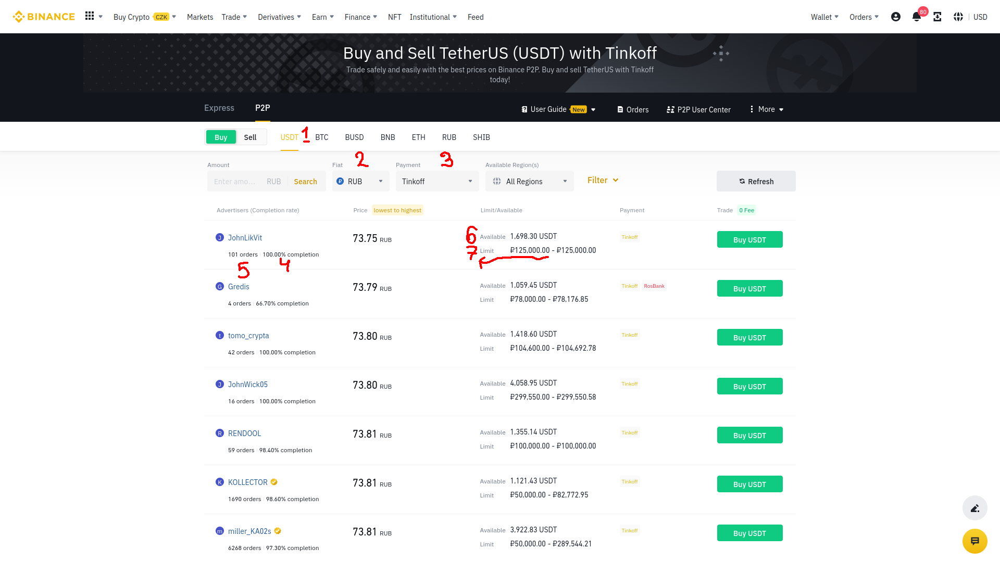

# Binance-P2P-Dashboard
Dash board for exploring P2P trading history with exact configurations


## Installation

1. Clone the repo
```
$ git clone https://github.com/JustTheWord/Binance-P2P-History-Dashboard.git
```
2. Install pip
```
$ sudo apt install python3-pip
```
3. Install pipenv
```
$ pip install pipenv
```
4. Go to the repo
```
$ cd Binance-P2P-History-Dashboard
```
5. Create /data and /logs directories in advance
```
$ mkdir data logs
```
6. Install from Pipfile all necessary packages
```
$ pipenv install
```
7. You may want to change the configuration. Open config.json with any editor.
 
 

8. Activate the Pipenv shell
```
$ pipenv shell
```
9. Run client app in background
```
$ cd app ; [nohup] python3 run.py &
```
10. Run the dashboard server
```
$ cd ../dashboard ; python3 dashboard
```
